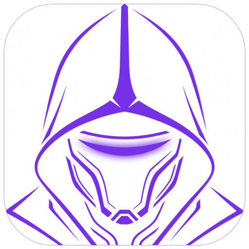
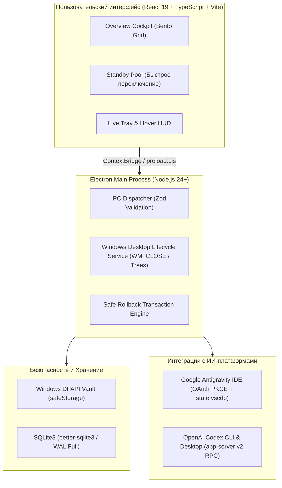
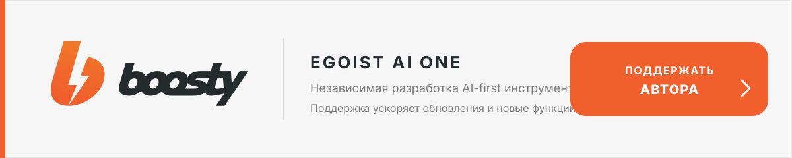

<div align="center">
  
  <h1>Account Manager EGO</h1>
  <p><strong>Автономный центр управления профилями, балансировки квот и бесшовного переключения аккаунтов для Google Antigravity IDE и OpenAI Codex на Windows 10/11.</strong></p>
  <p><em>100% локальное шифрование через Windows DPAPI · Атомарный Safe Rollback · Обход SMS-верификации · Нативный инсталлятор</em></p>

  <p>
    <a href="https://github.com/egoist-ai1/egoist-account-manager/releases/latest"></a>
    
    
    
    <a href="LICENSE"></a>
  </p>

  <p>
    <a href="https://github.com/egoist-ai1/egoist-account-manager/releases/latest"><strong>Скачать установщик (Setup .exe)</strong></a>
    ·
    <a href="https://github.com/egoist-ai1/egoist-account-manager/releases/latest"><strong>Портативная версия (Portable .exe)</strong></a>
    ·
    <a href="CHANGELOG.md">История изменений</a>
    ·
    <a href="https://boosty.to/eg01stgames"><strong>Поддержать автора</strong></a>
  </p>
</div>

---

## ⚡ О проекте

**Account Manager EGO** — инженерный инструмент для разработчиков, ежедневно работающих с ИИ-ассистентами в среде Windows. Приложение решает проблему исчерпания лимитов генерации кода, позволяя объединить несколько аккаунтов в единый пул с автоматическим или ручным переключением в 1 клик, сохранением открытых контекстов и контролем оставшихся квот в реальном времени.

### Поддерживаемые платформы (Dual-Engine)

1. **Google Antigravity IDE**:
   - Авторизация через системный доверенный браузер по протоколу **OAuth 2.0 PKCE** — полный обход повторных проверок и блокирующих SMS-челленджей Google (`VALIDATION_REQUIRED`).
   - Синхронизация сессий в хранилище IDE (`state.vscdb`: бинарный Protobuf `antigravityUnifiedStateSync.oauthToken` + JSON-статус) и Windows Credential Manager (`gemini:antigravity`).
   - Мониторинг 5-часовых и недельных скользящих окон квот моделей Gemini 3.8 Pro / Flash.
   - Двухфазная безопасная остановка и чистый перезапуск IDE с авто-очисткой зависших блокировок (`SingletonLock`, `lockfile`).

2. **OpenAI Codex (CLI & Desktop)**:
   - Поддержка ChatGPT подписок (Plus, Pro, Team, Enterprise), прямого OpenAI API Key и Enterprise токенов.
   - Интеграция с официальным JSON-RPC сервером Codex (`app-server v2`).
   - Мягкая остановка процессов через системные события `WM_CLOSE` с сохранением черновиков кода и истории в SQLite перед сменой пользователя.
   - Гарантированный атомарный откат (**Safe Rollback**) на предыдущий аккаунт в случае таймаута или ошибки запуска.

---

## 💎 Фирменный стиль «Lagom» и интерфейс

Интерфейс спроектирован по скандинавскому дизайн-стандарту **Lagom** (швед. *«ровно столько, сколько нужно»*):
- **Строгая триколор-палитра**: Глубокий чёрный фон `#000000`, чистый белый текст `#ffffff` и неоновый королевский фиолетовый акцент `#7c3aed` / `#8b5cf6`.
- **Чистота и контрастность (Anti-Slop & Zero Emoji)**: Никаких визуальных шумов, маркетинговых шаблонов и эмодзи. Только векторные SVG-иконки Lucide и чистые 4K-графические элементы.
- **Типографика Unbounded**: Премиальная геометрическая гарнитура `@fontsource-variable/unbounded` для акцентных метрик, статусов и заголовков.
- **Информативный трей (Live Tray & Hover)**: Компактный значок в Windows Taskbar в реальном времени отражает процент остатка квоты активного аккаунта. При наведении мыши открывается полупрозрачная HUD-панель с таймером сброса.

---

## 📦 Дистрибутивы и установка с нуля

Дистрибутив приложения полностью автономен (**Zero Dependencies**). Для установки на чистую Windows 10/11 **не требуются** предварительно установленные Node.js, Git, Python или пакетные менеджеры — все нативные бинарники SQLite, Chromium и среда Electron уже упакованы в исполняемый файл.

| Версия | Назначение | Исполняемый файл | Размер | SHA-256 |
| :--- | :--- | :--- | :--- | :--- |
| **Setup (Инсталлятор)** | Установка в систему с ярлыками и деинсталлятором | `Account-Manager-EGO-Setup-3.1.7.exe` | ~106 МБ | `41b8d69f80afdf14a73859d7c023b07555bf1734a26091eb30d6ba8dd4866bea` |
| **Portable** | Запуск без установки (с флешки или из любой папки) | `Account-Manager-EGO-3.1.7.exe` | ~102 МБ | `74960b79d7907eeb5ad80dea801da6b1628de3552747089837c922c7e068a76f` |

### Быстрый старт на новом устройстве

1. Скачайте [`Account-Manager-EGO-Setup-3.1.7.exe`](https://github.com/egoist-ai1/egoist-account-manager/releases/latest).
2. Запустите файл установки. Откроется нативный инсталлятор на C# WPF со стилем Lagom.
3. Выберите папку установки (по умолчанию `%LOCALAPPDATA%\Programs\Account Manager EGO`) и параметры ярлыков.
4. Нажмите **«Установить»** — инсталлятор выполнит распаковку с проверкой целостности, создаст ярлыки в меню «Пуск» / на Рабочем столе и зарегистрирует приложение в Windows.
5. При первом запуске приложение инициализирует локальное защищённое хранилище и обнаружит установленные среды Codex и Antigravity.

---

## 🔒 Безопасность и хранение данных

- **Локальный криптоконтейнер (Windows DPAPI)**: Все авторизационные токены, ключи и сессионные снимки шифруются на аппаратном уровне операционной системы с использованием Windows Data Protection API (`CryptProtectData`) с привязкой к текущему пользователю.
- **Изоляция данных**: Никакие токены, пароли, куки или ключи API никогда не передаются во внешнюю сеть. Все сетевые вызовы направлены исключительно на официальные endpoints провайдеров (`oauth2.googleapis.com`, `api.openai.com`).
- **Транзакционность переключений**: База данных SQLite работает в режиме Write-Ahead Logging (WAL) с параметром `synchronous=FULL`, исключая повреждение данных даже при внезапном отключении питания.

---

## 🛠️ Сборка из исходников (Для разработчиков)

### Требования к окружению
- **ОС**: Windows 10 или Windows 11 (x64)
- **Node.js**: v22+ (рекомендуется v24+)
- **Пакетный менеджер**: `pnpm` v10+
- **.NET Framework**: v4.0+ (для сборки C# установщика через `csc.exe`)

```powershell
# 1. Клонирование репозитория
git clone https://github.com/egoist-ai1/egoist-account-manager.git
cd egoist-account-manager

# 2. Установка зависимостей
pnpm install

# 3. Пересборка нативных модулей SQLite для тестов
pnpm run rebuild:native:node

# 4. Запуск тестов (380 тестов в 74 наборах)
pnpm test:run

# 5. Проверка типов и линтинг
pnpm run typecheck
pnpm run lint

# 6. Запуск в режиме разработки
pnpm run dev

# 7. Сборка продакшен-установщика (Modern Installer + NSIS LZMA)
pnpm run build:installer
```

---

## 🧭 Архитектурный обзор



---

## 🤝 Поддержать развитие проекта

Если **Account Manager EGO** помогает вам экономить время, эффективно распределять квоты и комфортно программировать, вы можете поддержать независимую разработку:

<p align="center">
  <a href="https://boosty.to/eg01stgames" title="Поддержать Egoist Ai One на Boosty">
    
  </a>
</p>

---

## 📄 Лицензия

Проект распространяется под открытой лицензией [MIT](LICENSE).  
Автор: **Egoist Gorbachev** ([egoist-ai1](https://github.com/egoist-ai1)).
