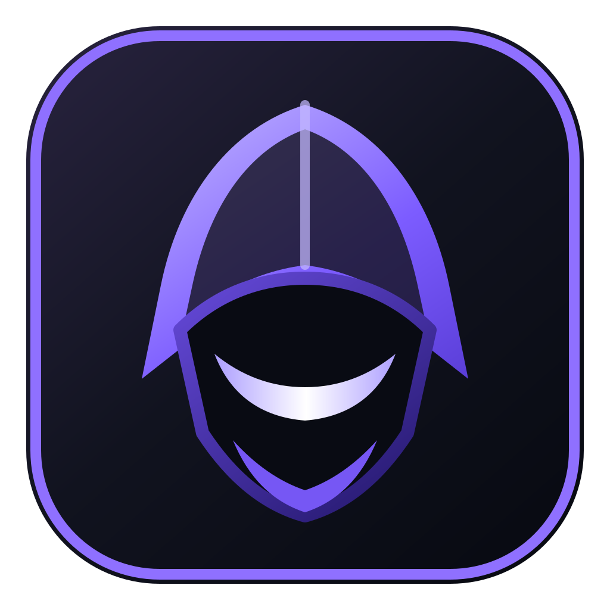
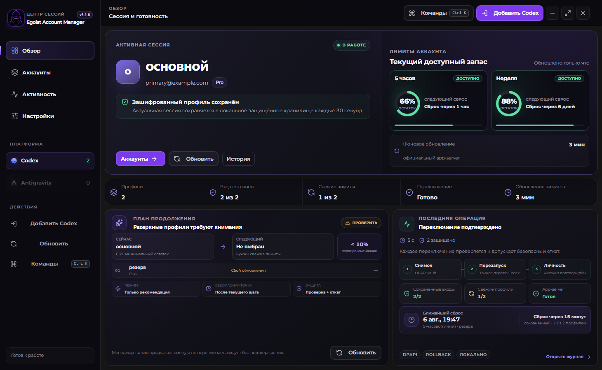
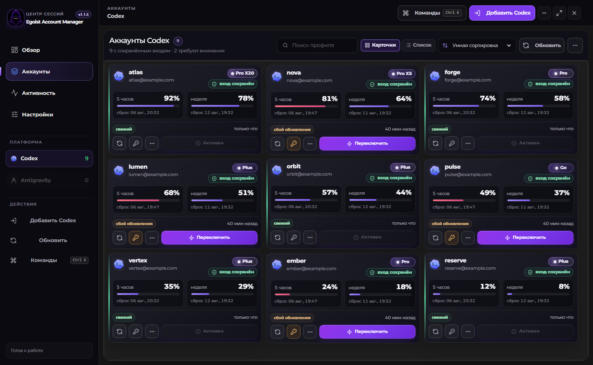
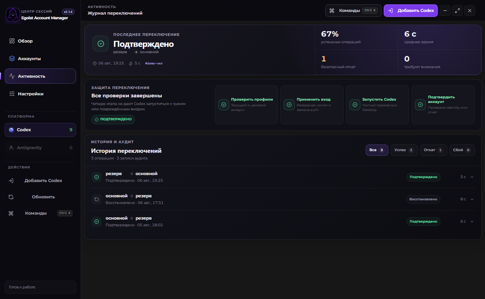
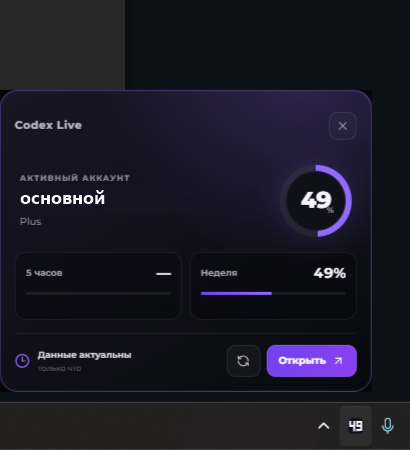
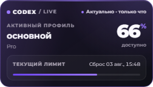

<div align="center">
  
  <h1>Egoist Account Manager</h1>
  <p><strong>Локальный центр управления Codex-профилями для Windows.</strong></p>
  <p>Защищённые входы, честные лимиты и проверяемое переключение аккаунта — без ручной замены файлов.</p>

  <p>
    <a href="https://github.com/egoist-ai1/egoist-account-manager/releases/latest"></a>
    
    <a href="LICENSE"></a>
  </p>

  <p>
    <a href="https://github.com/egoist-ai1/egoist-account-manager/releases/latest"><strong>Скачать стабильную версию</strong></a>
    ·
    <a href="docs/troubleshooting.md">Решение проблем</a>
    ·
    <a href="CHANGELOG.md">История изменений</a>
    ·
    <a href="https://boosty.to/eg01stgames"><strong>Поддержать автора</strong></a>
  </p>
</div>



> [!NOTE]
> Актуальная стабильная версия — [3.1.6](https://github.com/egoist-ai1/egoist-account-manager/releases/tag/v3.1.6). EXE распространяются без Authenticode-подписи; перед запуском сверяйте SHA-256 с манифестом релиза.

## Главное

| | Возможность | Что получает пользователь |
| --- | --- | --- |
| ⚡ | **Проверяемое переключение** | Manager закрывает точное дерево Codex, применяет выбранный вход, запускает приложение и подтверждает активный профиль. |
| 🛡️ | **Безопасный rollback** | Перед изменением создаётся снимок; при ошибке запуска или проверки прежний профиль восстанавливается. |
| 🔐 | **Долгоживущие входы** | Последний корректный auth bundle хранится в локальном DPAPI-vault и не заменяется частично записанным состоянием. |
| ◎ | **Честные лимиты** | Отображаются подтверждённый остаток, свежесть данных и фактическое время сброса без подмены неизвестного значения нулём. |
| ◫ | **Профили в одном окне** | Карточки и компактный список, поиск, статусы, подписка и быстрое действие для каждого аккаунта. |
| ◉ | **Живой tray** | Компактный значок показывает ограничивающий активный лимит, профиль и ближайший сброс. |

## Интерфейс

<table>
  <tr>
    <td width="50%"><strong>Аккаунты</strong><br />Активный профиль, подписка, сохранность входа, остаток лимита и действие переключения видны без открытия деталей.</td>
    <td width="50%"><strong>Активность</strong><br />Каждая операция раскрывается как понятный маршрут: проверка, применение, запуск, подтверждение или rollback.</td>
  </tr>
  <tr>
    <td></td>
    <td></td>
  </tr>
</table>

## Лимит прямо в панели задач

<table>
  <tr>
    <td width="48%"></td>
    <td>
      <strong>Остаток виден без открытия Manager.</strong><br /><br />
      Значок показывает процент фактически ограничивающего окна активного аккаунта. Наведение открывает прозрачную пассивную панель с тем же значением, свежестью данных и временем сброса; клик открывает рабочую панель Manager.
    </td>
  </tr>
</table>

<details>
  <summary><strong>Крупный план hover-панели</strong></summary>
  <br />
  
</details>

## Как проходит переключение

```text
Проверка профилей → DPAPI-снимок → применение входа → запуск Codex → проверка личности
                                              ↘ ошибка → безопасный rollback
```

Операция не считается успешной только потому, что файл записан. Manager фиксирует результат после запуска Codex и проверки целевого аккаунта; фазы и длительность остаются в локальном журнале.

## Авторизация

Поддерживаются официальные способы входа Codex:

- ChatGPT в браузере;
- device code;
- OpenAI API key;
- Enterprise access token.

Повторный вход обновляет профиль без создания дубля. Произвольный импорт `auth.json`, скрытое извлечение credentials и отправка токенов во внешние сервисы не используются.

## Что ещё умеет приложение

- автоматическое или ручное обновление лимитов;
- понятные состояния `свежий`, `устарел`, `нужен вход` и `сбой обновления`;
- восстановление проблемного профиля прямо из его карточки;
- защищённый перенос профилей через `.cam-export`;
- поиск, избранное, архив и журнал изменения лимитов;
- внутренняя система уведомлений и управление из системного tray;
- проверка новых стабильных версий через GitHub Releases;
- локальный диагностический отчёт без токенов, cookies, API keys и персональных путей.

## Безопасность и хранение

- Профили и rollback-снимки шифруются через Electron `safeStorage` / Windows DPAPI и остаются на текущем ПК.
- Перенос между компьютерами использует `scrypt` + AES-256-GCM.
- SQLite работает с WAL, `synchronous=FULL` и single-active invariant.
- Токены, cookies, API keys и сырой `auth.json` не выводятся в интерфейс, уведомления и диагностические отчёты.
- Проверка обновлений обращается только к публичному GitHub Releases API проекта и не устанавливает EXE скрыто.

Подробнее: [модель безопасности](SECURITY.md) и [архитектура](docs/ARCHITECTURE.md).

> [!IMPORTANT]
> Это неофициальный community-инструмент, не связанный с OpenAI. Используйте только аккаунты, которыми владеете или которыми имеете право управлять.

## Установка

1. Откройте [последний стабильный GitHub Release](https://github.com/egoist-ai1/egoist-account-manager/releases/latest).
2. Скачайте installer или portable EXE с номером опубликованного тега.
3. Сверьте SHA-256 с `SHA256SUMS-<version>.txt` из того же релиза.
4. Запустите Manager и добавьте профиль одним из официальных способов входа.

Текущие EXE не подписаны CA-trusted Authenticode-сертификатом. SmartScreen может показать предупреждение, а Smart App Control — заблокировать запуск. Не отключайте защиту Windows ради установки; на таком устройстве дождитесь подписанной сборки.

## Проект

Electron · React · TypeScript · Vite · SQLite · Windows DPAPI

- [Последние release notes](docs/releases/README.md)
- [Полный CHANGELOG](CHANGELOG.md)
- [Документация разработчика](docs/development.md)
- [Лицензия MIT](LICENSE)
