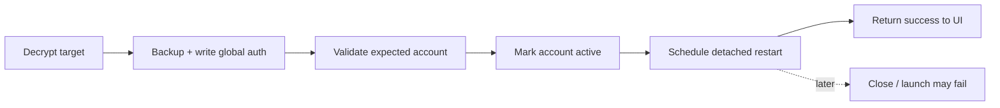

# Egoist Account Manager: архитектурный и конкурентный аудит

Дата среза: 2026-07-29 (Europe/Moscow)
Объект: Windows-приложение `Egoist Account Manager` в этом репозитории
Цель: определить, что мешает быстрому и надёжному переключению аккаунтов Codex Desktop, какие решения доказали конкуренты и что должно войти в следующую версию.

## Итог

Текущая версия уже заметно сильнее простых `auth.json`-switcher'ов: есть зашифрованное хранилище, официальный `codex app-server`, квоты, backup/rollback и попытка мягкого перезапуска Desktop. Но заявленный бесшовный сценарий пока не доказан.

Главный дефект — неверная граница транзакции. Менеджер сначала заменяет глобальную авторизацию и помечает профиль активным, затем лишь планирует detached-перезапуск. Успешное планирование скрипта принимается за успешное переключение, хотя Codex может не закрыться, не открыться либо открыться со старой identity. При ошибке после записи автоматического rollback нет.

Ни один исследованный Windows-конкурент не реализует полный подтверждённый цикл:

> graceful close → quiesce всего дерева → transactional activation → exact-package launch → readiness → identity verification → commit/rollback

Это не повод повторять их упрощения; это главная возможность продукта.

## Методика и границы

Исследование объединяет четыре класса доказательств:

1. Локальный код, история Git, тесты, установленная версия Codex и визуальная проверка UI при 980×640, 1180×760 и 1440×900.
2. Актуальная документация и versioned schema установленного `codex app-server`.
3. Исходники open-source инструментов на зафиксированных commit SHA.
4. Коммерческие продукты, release notes и отчёты пользователей об отказах.

Конкурентные утверждения без исходников считаются идеями, а не доказательством надёжности. Private ChatGPT endpoints и самостоятельно скопированные OAuth client details не рассматриваются как стабильный контракт.

## Фактическое состояние проекта

| Параметр | Результат |
| --- | --- |
| Репозиторий | `projects/codex-account-manager-gh` |
| Ветка | `codex/commercial-v1-antigravity` |
| Версия в `package.json` | `2.3.0` |
| Последняя зафиксированная версия | Git tag/commit `v1.9.3` / `bec1dee`, 2026-05-17 |
| Статус 2.3.0 | большой незакоммиченный пользовательский worktree поверх 1.9.3 |
| Масштаб worktree | 56 изменённых tracked и 99 untracked файлов; около 9k additions и 8.8k deletions |
| Stack | Electron, React, TypeScript, Vite, SQLite (`better-sqlite3`) |
| Установленный Codex | MSIX `OpenAI.Codex` 26.721.4979.0; AppID `OpenAI.Codex_2p2nqsd0c76g0!App` |
| CLI | `codex-cli 0.144.0`; ChatGPT login активен |

Следствие: текущая 2.3.0 — самая новая рабочая реализация, но не воспроизводимый релиз. Перед продуктовой переделкой её нужно сохранить отдельным checkpoint-коммитом либо веткой по решению владельца; аудит ничего из существующих изменений не переписывал.

## Что уже сделано хорошо

- Локальный SQLite store и account/event model лучше разрозненных JSON-файлов.
- Для ChatGPT OAuth используется официальный `codex app-server`, а не собственная копия OAuth протокола.
- Inactive account secrets шифруются через Electron `safeStorage` и AES.
- `SwitchService` валидирует expected account identity, создаёт backup и применяет atomic rename.
- Есть per-platform in-process защита от двойного switch.
- Квоты 5h/week, plan, freshness, risk state и ручная re-auth хорошо читаются на карточке.
- Windows runner избегает безусловного force-kill и умеет Store activation с fallback.

## Критические разрывы

| Приоритет | Разрыв | Текущее поведение | Риск |
| --- | --- | --- | --- |
| P0 | Неверный порядок switch | `auth.json` меняется до подтверждённого закрытия Codex | старый процесс и новая auth state существуют одновременно |
| P0 | Ложный success | detached runner только запланирован; его результат не возвращается в UI | пользователь видит успех при фактическом отказе |
| P0 | Нет автоматического rollback | post-write/relaunch/identity failure не восстанавливает предыдущий профиль | белое окно, login loop, неверный account |
| P0 | Нет end-to-end lock | mutex берётся внутри уже записанного PowerShell script; имена файлов фиксированы | параллельные switch могут переписать runner друг другу |
| P0 | Package ambiguity | `Select-Object -First 1` среди `OpenAI.Codex`/`OpenAI.ChatGPT` | запуск не того приложения при coexistence с ChatGPT Classic/new app |
| P0 | Build policy сломана | pnpm 11 видит строковые placeholders в `allowBuilds` | native dependencies не устанавливаются, полный test/release gate не запускается |
| P1 | Неполный process classifier | graceful runner учитывает только Store root-path shape | standalone/новый package layout может остаться живым |
| P1 | Секреты остаются plaintext | отдельные profile homes сохраняют `auth.json` после refresh/login | README обещает более сильную защиту, чем фактически обеспечено |
| P1 | Нет first-class auth mode | validation принимает только ChatGPT account | API key/access token уже поддержаны Codex, но не менеджером |
| P1 | Refresh lineage | копии mutable OAuth state могут независимо ротировать refresh token | ранее сохранённый профиль внезапно перестаёт входить |
| P1 | Monolithic UI/core | `App.tsx` ≈2591 строк, `styles.css` >5600, `accountManager.ts` >2000 | риск регрессий и дорогая дальнейшая доработка |
| P1 | Unsigned update path | code-signature verification отключена | публичный auto-update нельзя считать fail-closed |

## Текущий switch flow

`SwitchService` завершает и записывает успешное событие до начала Desktop lifecycle. Ошибка scheduler только логируется, а поздняя ошибка PowerShell runner вообще не меняет результат операции.

## Авторизация и сохранение сессий

Актуальный официальный `app-server` документирует browser ChatGPT login, device-code login и API key, сам владеет refresh tokens и отдаёт identity/rate limits через versioned JSON-RPC. Схемы генерируются установленной версией CLI, поэтому их нужно использовать вместо hand-written assumptions: [OpenAI Codex app-server auth endpoints](https://github.com/openai/codex/blob/85c082ccccf6b5ac4d6c31d14f960057348b78f4/codex-rs/app-server/README.md#auth-endpoints).

Локально сгенерированная schema 0.144.0 также содержит `chatgptAuthTokens`; CLI предлагает `--with-api-key`, `--with-access-token` и `--device-auth`. Текущий менеджер показывает только browser и device code.

Поддерживаемая модель следующей версии:

- ChatGPT OAuth через официальный browser flow;
- ChatGPT device code как обязательный fallback для сломанного browser callback;
- OpenAI API key как отдельный тип профиля без ложных ChatGPT quota labels;
- Enterprise access token через capability-detected official CLI/app-server flow;
- импорт текущей авторизации и `auth.json` только как recovery/migration, с identity validation;
- Amazon Bedrock/provider profiles — отдельный следующий milestone, потому что это уже переключение `config.toml` и provider credentials, а не только ChatGPT account.

Нельзя гарантировать «вечную» авторизацию: provider может отозвать сессию, деактивировать workspace или изменить policy. Реалистичная гарантия — каждый account один раз входит в собственном isolated home, rotated token немедленно сохраняется обратно в vault, expiry/drift видны заранее, а re-auth не уничтожает sessions.

### Почему простое копирование auth недостаточно

- Скопированные OAuth states иногда работают до первой refresh rotation, после чего одна копия получает 401: [Codex issue #15410](https://github.com/openai/codex/issues/15410), [#15502](https://github.com/openai/codex/issues/15502).
- Invalid refresh token может дать белое окно вместо login prompt: [#20125](https://github.com/openai/codex/issues/20125).
- Stale workspace identity может зациклить splash: [#19075](https://github.com/openai/codex/issues/19075).
- После switch удалённая WSL/SSH connection может продолжать использовать старую auth до отдельного restart: [#22419](https://github.com/openai/codex/issues/22419).

## Windows process lifecycle

Установленный OpenAI desktop уже меняется: новый ChatGPT desktop объединяет Chat, Work и Codex и может сосуществовать с ChatGPT Classic. Поэтому запуск по имени процесса или «первому найденному» package недопустим: [Moving to the new ChatGPT desktop app](https://help.openai.com/en/articles/20001276).

Реальные отчёты показывают, что close/tray Quit не гарантирует остановку root, helpers, `codex.exe`, WSL и app-server. Это приводит к black window и file locks: [#24913](https://github.com/openai/codex/issues/24913), [#26624](https://github.com/openai/codex/issues/26624), [#20269](https://github.com/openai/codex/issues/20269).

Новая реализация должна:

1. Зафиксировать exact package family/AppID, executable path, root PID, descendants и start times до закрытия.
2. Мягко закрыть main window и дождаться не окна, а исчезновения зафиксированного дерева/освобождения managed auth files.
3. При timeout остановиться до записи auth. Опциональный full-auto fallback разрешается один раз пользователем и завершает только зафиксированное дерево, никогда все процессы по имени.
4. Записать auth bundle транзакционно.
5. Запустить тот же package identity.
6. Подтвердить visible window/readiness и `account/read` с target account/workspace ID.
7. Только затем пометить профиль активным; при любом post-write failure восстановить предыдущий bundle и relaunch.

## Конкуренты: что действительно стоит перенять

| Продукт | Проверенная сильная сторона | Почему не копируем целиком |
| --- | --- | --- |
| Official Codex app-server | versioned auth/quota API, official token refresh, typed schema, bounded queues/backoff | не управляет multi-account Desktop lifecycle |
| [Pimpmuckl/codex-account-switcher](https://github.com/Pimpmuckl/codex-account-switcher/blob/7e27ed0959cbb80bc970c1cb102603f7ba5dec2b/src/codex.rs) | manifest, crash recovery, previous/target bytes, stable verification после write | local store фактически gzip/base64, нет DPAPI и relaunch |
| [steipete/CodexBar](https://github.com/steipete/CodexBar/blob/b036579b4b055bac16033f74481ee1ff26cc1317/Sources/CodexBar/ManagedCodexAccountService.swift) | отдельный `CODEX_HOME`, official login, commit metadata только после verified identity | macOS; picker меняет monitored account, не Desktop identity |
| [Ducksss/codex-profiles](https://github.com/Ducksss/codex-profiles/blob/b0df2dd0ab955eb712436f234bbab984cc017992/bin/codex-profile) | изоляция `CODEX_HOME` + Electron user-data; повторное использование сессии | Desktop scheme подтверждена не на Windows; нет identity verification |
| [farion1231/cc-switch](https://github.com/farion1231/cc-switch/blob/56fb46c09310ff52dabefd2b32f0e799e8357d9e/src-tauri/src/services/provider/mod.rs) | per-app lock, outgoing backfill, per-account refresh mutex, rollback части multi-file write | plaintext refresh-token file и неполный metadata rollback |
| [Lampese/codex-switcher](https://github.com/Lampese/codex-switcher/blob/31e2b962009a51f27e964fa5c1984b1aeb237079/src-tauri/src/auth/oauth_server.rs) | PKCE/state, loopback port fallback, timeout/cancel, refresh retry/backoff, актуальный Windows process classifier | plaintext accounts, non-atomic writes, force kill, нет relaunch; лицензия не указана |
| [isxlan0/Codex_AccountSwitch](https://github.com/isxlan0/Codex_AccountSwitch/blob/21ac43ff4c2e222ac61aa56295aa76129249d222/Codex_AccountSwitch/webview_host.cpp) | богатый Windows dashboard, quota prompts, token/traffic analytics, proxy rotation | hot proxy routing меняет upstream, не Desktop identity; private endpoints; truncating writes |
| [nesszer/Win-CodexBar](https://github.com/nesszer/Win-CodexBar/blob/b3569de374391b34f50d971f5c58c0981800763b/apps/desktop-tauri/src-tauri/src/commands/providers.rs) | DPAPI, adaptive refresh, bounded concurrency, superseded-result generations, tray bars | Codex accounts не переключает; Codex token не refresh-ит |
| 1DevTool | encrypted snapshots, `__previous__`, drift status, quotas/alerts, spare-account suggestion | закрытый код; перезапускает terminal, не Codex Desktop |
| Session Switcher / SessionBox / Wavebox | явные local/synced/temporary browser profiles и быстрый account picker | изолируют browser cookies, не Codex CLI/Desktop auth |

### Самые ценные code-level паттерны

1. **Outgoing backfill.** Перед активацией target сохранить текущий live auth в профиль, которому он действительно принадлежит. Это не теряет новый refresh token.
2. **Prepared manifest.** До первого destructive write записать previous/target hashes, transaction ID, phase и exact process identity.
3. **Crash recovery.** На startup восстановить или завершить orphaned transaction идемпотентно.
4. **Stable verification.** После write несколько раз проверить bytes и account identity, чтобы обнаружить обратную перезапись живым Codex.
5. **Commit last.** `activeAccountId` меняется только после restart + identity proof.
6. **Per-account refresh mutex.** Одновременные quota refresh/re-auth одного profile не должны ротировать token дважды.
7. **Generation IDs.** Поздний результат предыдущего refresh не перетирает более новый UI state.

## Коммерческий рынок и UI-паттерны

OpenAI позволяет держать два аккаунта одновременно только в ChatGPT web; Codex desktop/native не поддерживается официальным switcher: [OpenAI account switching](https://help.openai.com/en/articles/20001068-use-multiple-accounts-with-account-switching).

Лучшие переносимые элементы:

- 1DevTool: status-bar quota, exact reset, threshold alert один раз на quota window, предложение профиля с запасом и drift state «signed in, not saved».
- Codex Switcher: cached-first menu, background refresh, plan/quota/reset в compact picker, browser/device/API key/access-token onboarding.
- unrevoke: health states, last refresh, tags/categories, быстрый global picker; надёжность этих функций подтверждена только заявлениями поставщика.
- SessionBox: пользователь явно выбирает local/synced/temporary тип профиля.
- Wavebox: persistent sidebar, spaces, keyboard navigation, tray access.

Список и цены быстро меняются; они зафиксированы только на дату среза. Основные коммерческие страницы: [1DevTool account switcher](https://1devtool.com/blog/ai-account-switcher-usage-memory-manager), [1DevTool usage dashboard](https://1devtool.com/features/ai-usage-dashboard), [Codex Switcher](https://www.codexswitch.com/how-to-switch-codex-accounts-on-mac), [Session Switcher](https://chromewebstore.google.com/detail/session-switcher-ai-accou/oianbflnhmnfcpahokfmgchdpknccmai).

## Визуальный аудит 2.3.0

Проверен реально собранный renderer, а не старые screenshots из `artifacts`.

Сильные стороны:

- согласованная тёмная purple-система;
- хорошие quota bars и freshness/risk labels;
- карточки читаются без обучения;
- responsive layout не обрезает основные действия.

Проблемы:

- на 1440×900 после двух карточек остаётся большая пустая область;
- typography и вторичные controls слишком мелкие/низкоконтрастные;
- верхний и боковой `Добавить Codex` дублируются;
- collapsed sidebar при 980 px теряет accessible names у icon-only navigation;
- Settings использует пространство неэффективно и не содержит restart/storage/diagnostic policies;
- add-account dialog предлагает только device/browser;
- switch dialog обещает атомарность и restart, хотя runner outcome не наблюдается;
- полный changelog в modal слишком велик для first-run;
- avatar asset около 1.3 MB непропорционален UI;
- крупные монолиты `App.tsx`/`styles.css` затрудняют системный редизайн.

## Проверка исходного состояния

| Проверка | Результат |
| --- | --- |
| Plugin surface check | прошёл; новых установок нет, restart не требуется |
| Direct TypeScript `tsc --noEmit` | прошёл |
| Direct ESLint | прошёл |
| Direct Vite renderer build | прошёл; ≈300 kB JS, ≈86 kB CSS, avatar ≈1.3 MB |
| Direct Vitest | 45 файлов прошли, 178 tests прошли; 3 suites не загрузились из-за неустановленного Electron native artifact |
| Repository-native pnpm gate | блокирован неправильным `pnpm-workspace.yaml` для pnpm 11 (`allowBuilds` placeholders) |

Это baseline, не release verdict: пока pnpm policy не исправлена, packaged Electron и полный test gate не воспроизводимы.

## Рекомендуемый порядок работ

### P0 — сделать switch истинной транзакцией

- единый cross-process mutex, transaction journal и crash recovery;
- quiesce до auth write;
- exact package/PID lifecycle;
- outgoing backfill, multi-file auth bundle и atomic durable replace;
- relaunch readiness + identity verification;
- automatic rollback/relaunch previous account;
- progress events и честный UI result.

### P0 — восстановить воспроизводимый build/release gate

- исправить pnpm 11 build-script allowlist;
- закрепить Node/pnpm version;
- прогнать native rebuild, full tests, package/install smoke;
- публичный updater включать только при signature/publisher/checksum verification.

### P1 — расширить auth и persistence

- browser, device, API key, Enterprise access token, import current/recovery;
- auth mode/workspace ID как first-class fields;
- encrypted inactive profiles; plaintext hydration только на время official app-server/Codex use;
- expiry, drift, needs-reauth и last-good state;
- forward-only SQLite migration с проверенным restore.

### P1 — перепроектировать UI

- dashboard использует свободную высоту для health/activity, а не пустого фона;
- account row/card density toggle, tags/favorites и command palette;
- отдельный switch progress sheet с фазами и rollback;
- onboarding по auth methods;
- restart/storage/privacy/diagnostics settings;
- доступные labels, focus, contrast и responsive states;
- component/features split и компактные design tokens.

### P2 — автоматизация после доказанной базы

- threshold alerts с cooldown и recommended spare account;
- user-approved automatic switch только в idle state;
- tray quick switch;
- WSL/remote connection detection и явный remediation;
- provider profiles (включая Bedrock) отдельным milestone.

## Ограничения исследования

- Нет официального OpenAI API для внешнего multi-account переключения Desktop; это compatibility layer поверх локального state.
- Не опубликованы гарантии lifetime refresh token, поддержка внешнего `CODEX_HOME` в Windows MSIX или contract для restart remote connections.
- Ни один конкурент не публикует длительные Windows soak/fault-injection метрики.
- Коммерческие claims не равны проверенному коду.
- Реальные переключения между двумя личными аккаунтами в ходе аудита не выполнялись: это изменило бы пользовательскую сессию и потребовало бы интерактивной авторизации.

Подробный утверждаемый план реализации находится в `docs/product-3.0-spec-2026-07-29.md`.
