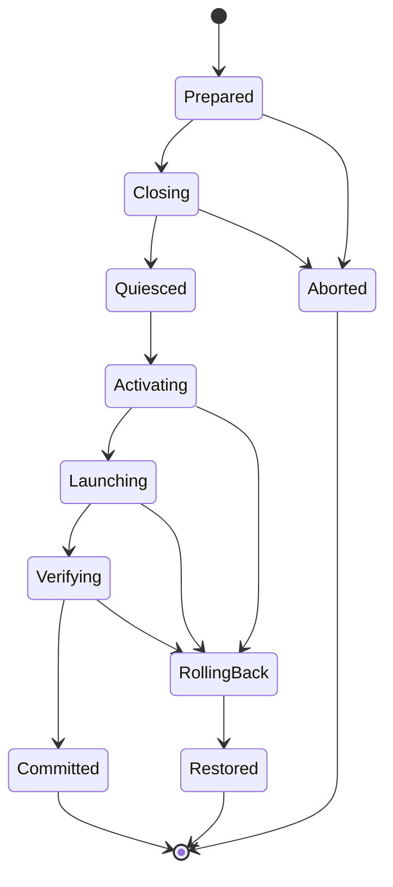

# Egoist Account Manager 3.0 — спецификация

Статус: proposed, требуется явное утверждение владельца
Дата: 2026-07-29
Платформа первого релиза: Windows 11, per-user Electron application

## 1. Результат

Пользователь выбирает сохранённый Codex profile и получает один наблюдаемый процесс:

1. Менеджер подтверждает готовность target profile.
2. Полностью и безопасно останавливает текущий OpenAI Desktop context.
3. Транзакционно активирует target credentials.
4. Запускает тот же установленный Codex/ChatGPT package.
5. Проверяет, что новое окно действительно работает под выбранным account/workspace.
6. Только после этого показывает success и сохраняет target как active.
7. При отказе восстанавливает предыдущую авторизацию и пытается вернуть предыдущий рабочий Desktop.

Приложение остаётся local-first, не отправляет секреты стороннему backend и не использует private ChatGPT endpoints как обязательный контракт.

## 2. Пользователь и сценарии

Основной пользователь — один Windows-пользователь с 2–20 личными, рабочими или клиентскими Codex profiles.

Обязательные сценарии:

- первый вход через browser ChatGPT OAuth;
- device-code fallback, когда browser callback не работает;
- API key profile;
- Enterprise access-token profile при наличии capability в установленном Codex;
- импорт текущей действующей Codex identity;
- повторная авторизация существующего profile без потери metadata/history;
- one-click switch с автоматическим close/relaunch;
- восстановление после crash/power loss на любой фазе switch;
- просмотр quota freshness, health, activity и диагностируемой причины отказа;
- быстрый switch из main window, command palette и tray.

## 3. Не входит в 3.0

- обход OAuth/MFA/CAPTCHA или автоматический выбор Google/Microsoft/Apple account в браузере;
- обещание бессрочной сессии при provider-side revoke/workspace deactivation;
- переключение Claude/Gemini/Antigravity в той же транзакции;
- поддержка macOS/Linux;
- private reverse proxy и hot routing ChatGPT subscription tokens;
- автоматическое вмешательство в WSL/SSH remote connection без документированного upstream contract;
- cloud sync секретов;
- публичный auto-update без подписанного installer/binary.

Amazon Bedrock и другие provider profiles планируются как 3.1 после стабилизации ChatGPT/OpenAI lifecycle.

## 4. Принятые архитектурные решения

### 4.1 Official auth boundary

- Login, refresh, identity и quotas идут через установленный `codex app-server`.
- На startup генерируется/проверяется schema конкретной версии Codex либо используется совместимый cached schema по exact CLI version.
- Experimental auth methods включаются только через capability detection.
- Собственный OAuth client не реализуется.
- `CODEX_HOME` создаётся отдельно для каждого managed profile; один OAuth state не клонируется между homes.

### 4.2 Секреты

- Inactive secrets хранятся в versioned encrypted vault, защищённом Windows user context через Electron `safeStorage`; secret bytes не попадают в SQLite/logs/telemetry.
- Для official Codex file mode target bundle временно hydrate-ится с ACL текущего пользователя.
- После остановки profile app-server его plaintext auth удаляется либо заменяется encrypted-at-rest representation; глобальный active `~/.codex/auth.json` остаётся только потому, что его требует работающий Codex.
- Перед switch outgoing live auth backfill-ится в правильный vault profile, чтобы сохранить rotated refresh token.
- Keyring/`auto` credential-store state обнаруживается явно; менеджер не меняет глобальную настройку пользователя молча.

### 4.3 Один primary store

SQLite в WAL mode остаётся primary metadata/event store. Vault blobs — отдельный encrypted secret store, на который SQLite ссылается opaque identifier/fingerprint. Второго metadata store не вводится.

### 4.4 UI architecture

React/Electron остаются: rewrite на Tauri/C++ не даёт достаточной выгоды относительно риска. Код делится по feature boundaries; preload остаётся единственной typed IPC boundary, renderer не получает Node access.

## 5. Switch transaction

### 5.1 Prepare

1. Acquire Windows named mutex в main process до файлов/scripts/DB mutation.
2. Создать UUID transaction и SQLite row `status=prepared`.
3. Обнаружить exact installed package: package family, AppUserModelId, executable, version.
4. Снять root PID/descendants/start-time snapshot.
5. Считать live auth bundle, определить его identity, backfill в outgoing profile.
6. Decrypt и валидировать target bundle, auth mode, account/workspace ID и fingerprint.
7. Записать durable recovery manifest без secret contents: hashes, paths, process identity, previous/target profile IDs, current phase.

На этой фазе target ещё не активирован; cancel безопасен.

### 5.2 Quiesce

1. Отправить graceful close exact main window.
2. Ждать исчезновения зафиксированного root и descendants с bounded polling.
3. Проверить, что managed auth/state files больше не изменяются и не удерживаются известным OpenAI tree.
4. Если timeout:
   - в `graceful-only` — abort без изменения auth;
   - в `automatic exact-tree fallback` — завершить только PID с совпадающими start-time/ancestry, затем повторно проверить quiesce.

Рекомендуемый UX: fallback включается пользователем один раз с предупреждением о незавершённой работе. После включения дальнейшие switch полностью автоматические. Никогда не используется `Stop-Process -Name ChatGPT,Codex` без exact identity.

### 5.3 Activate

1. Stage target bundle в unique transaction directory.
2. Validate staged JSON/schema/identity.
3. Durable atomic replace каждого managed file; `auth.json` обязателен, `cap_sid` и compatibility state включаются только когда присутствуют/нужны обнаруженной версии.
4. Read-back verify bytes, permissions и identity.
5. Не менять `accounts.active` до полной проверки Desktop.

### 5.4 Launch and verify

1. Запустить сохранённый AppUserModelId exact package version; fallback executable разрешён только из той же resolved installation.
2. Дождаться нового root PID и visible responsive window.
3. Запустить bounded official `app-server` probe против global active home.
4. `account/read` должен вернуть target account/workspace ID и ожидаемый auth mode.
5. Для ChatGPT дополнительно получить fresh/accepted rate-limit response либо классифицированный non-fatal quota error.
6. Записать `status=committed`, затем и только затем обновить active profile.

### 5.5 Rollback

Любая ошибка после первого live write переводит transaction в `rolling_back`:

1. Quiesce ошибочно запущенный target tree, если он появился.
2. Восстановить previous bundle из prepared backup.
3. Verify previous identity.
4. Relaunch previous exact package и проверить readiness/identity.
5. Записать `restored` либо `recovery_required` с безопасной actionable diagnostic.

На startup менеджер первым делом reconciles незавершённую transaction. Операции recovery идемпотентны.

## 6. Concurrency и состояние

- Один system-wide switch mutex на Windows user session.
- Один refresh/re-auth mutex на profile.
- Switch, re-auth и quota refresh одного profile не пересекаются.
- Каждый background refresh имеет generation ID; superseded result не обновляет UI/store.
- Fixed runner filenames заменяются transaction-unique files либо in-process child с authenticated IPC.
- Внешнее изменение live auth переводит UI в `drifted`; менеджер не приписывает credentials выбранному profile без identity match.

## 7. Data model

### `accounts` additions

- `auth_mode`: `chatgpt | api_key | enterprise_access_token`;
- `provider_account_id`, `workspace_account_id`, `workspace_label`;
- `auth_fingerprint`, `vault_blob_id`, `credential_state`;
- `last_authenticated_at`, `last_refreshed_at`, `expires_at`;
- `health_state`, `health_reason`, `last_good_at`;
- `version` для optimistic update.

Constraints: unique natural identity `(platform, auth_mode, provider_account_id, workspace_account_id)` там, где IDs доступны; API key profile имеет отдельный stable fingerprint, не сам key.

### `switch_transactions`

- UUID `id`, previous/target account IDs;
- detected package identity/version;
- process snapshot hash;
- phase/status;
- previous/target bundle hashes;
- started/updated/completed UTC timestamps;
- error code, rollback status, diagnostic-log reference;
- никакого token/file contents.

### Migration

Forward-only migration с pre-migration SQLite backup и проверенным restore. Старые event rows сохраняются. При первом запуске 3.0 существующие profiles получают `auth_mode=chatgpt` только после identity validation; сомнительные переходят в `needs_review`.

## 8. Auth onboarding

Add-account sheet показывает методы как равноправные, но объясняет различия:

1. **ChatGPT в браузере** — основной метод; browser page сама предлагает доступные Google/Microsoft/Apple/email routes.
2. **Код устройства** — лучший fallback для callback/remote/headless проблем.
3. **API key** — отдельный OpenAI API billing, без subscription quota UI.
4. **Enterprise access token** — only when advertised; secret вводится через protected field/stdin и никогда не попадает в argv/log.
5. **Импорт текущего входа** — identity preview, conflict resolution, outgoing ownership.
6. **Recovery import** — explicit warning, schema/identity validation, encrypted storage immediately after import.

`Импорт текущего входа` создаёт switchable-профиль только для подтверждённого file-backed `auth.json`. `keyring`, `auto` и `ephemeral` показываются как linked-only/needs-login: публичного credential-export RPC нет, поэтому Manager не извлекает OS secrets и не меняет `config.toml`. File picker остаётся в main process, принимает regular file до 1 MiB, выполняет stable-read и не отдаёт содержимое renderer.

Login success фиксируется только после `account/read`; duplicate email в разных workspaces различается по provider/workspace account ID.

## 9. Интерфейс

Визуальное направление: спокойный native control plane — плотность Raycast/Linear, ясность OpenAI Desktop, без декоративной перегрузки. Сохраняется тёмная база и фиолетовый accent, но вводится нейтральная token-система, более сильный contrast и 8px spacing grid.

### Information architecture

- **Overview**: active identity, health, current 5h/week quota, recommended spare profile, recent switch activity.
- **Accounts**: compact rows/cards toggle, search, filters, tags/favorites, auth-mode badges, last verified/expiry/drift.
- **Activity**: switch/re-auth/rollback timeline без secret data.
- **Settings**: lifecycle, auth storage, refresh, alerts, appearance, startup/tray, diagnostics/update.

Antigravity остаётся отдельным module/route и не смешивается с Codex transaction UI.

### Switch UX

- One-click action при выключенном confirmation либо confirm sheet с previous→target.
- Progress overlay с фазами `Подготовка`, `Закрытие`, `Активация`, `Запуск`, `Проверка` и elapsed time.
- Cancel разрешён только до first live write.
- Failure показывает: что не произошло, сохранился ли предыдущий аккаунт, был ли rollback/relaunch успешен и одну следующую команду.
- Success показывает verified email/workspace/auth mode, а не только «перезапуск запланирован».

### Responsive и accessibility

- Breakpoints проверяются на 980×640, 1180×760, 1440×900, 1920×1080 и 125/150% Windows scaling.
- Collapsed navigation сохраняет `aria-label`, tooltip и visible focus.
- Keyboard-only полный flow, command palette, Escape semantics, reduced motion.
- Контраст WCAG AA для текста/status; target size минимум 36px desktop и 44px для primary touch-like actions.
- Большая пустая нижняя область используется activity/health panel; scroll появляется только внутри осмысленных regions.

### Code split

- `features/accounts`, `features/auth`, `features/switching`, `features/activity`, `features/settings`;
- `components/ui` только для повторяемых primitives;
- CSS design tokens + feature styles вместо одного файла >5600 строк;
- state machine/types разделяются между main/preload/renderer через explicit DTO, secret types renderer не видит;
- avatar asset оптимизируется и имеет size budget.

## 10. Настройки

- confirmation before switch;
- shutdown policy: `graceful-only` / `automatic exact-tree fallback`;
- graceful и fallback timeout в безопасных пределах;
- launch at login и tray behavior;
- quota refresh cadence/adaptive mode;
- 5h/week alert thresholds и per-window cooldown;
- auto-suggest spare profile; auto-switch не включён по умолчанию;
- vault/storage status, export metadata, backup retention;
- diagnostic bundle с redaction preview;
- language RU/EN, theme system/dark/light, density compact/comfortable;
- update channel stable/beta; public update требует verified signature.

## 11. Error model и diagnostics

Typed error codes по фазам: package ambiguity, running work, graceful timeout, exact-tree mismatch, file locked, target invalid, write/read-back mismatch, launch timeout, identity mismatch, rollback failure, app-server incompatible, auth revoked, workspace unavailable.

Логи:

- structured JSONL с transaction ID, phase, duration и redacted identities;
- path/token/JWT/cookie/API key никогда не логируются целиком;
- runner output возвращается через IPC, а не остаётся единственным свидетельством в detached log;
- diagnostic export показывает preview и требует явного подтверждения.

## 12. Build, packaging и update

1. Исправить pnpm 11 `allowBuilds` и удалить конфликтующий legacy script policy.
2. Закрепить Node/pnpm; clean install должен собирать Electron/esbuild/better-sqlite3 без интерактива.
3. Native module ABI rebuild выполняется package-native command.
4. Installer per-user, clean uninstall сохраняет user data по умолчанию.
5. Public binaries/installer подписываются Authenticode с RFC 3161 timestamp; рядом публикуется checksum.
6. Auto-update fail-closed по signature/publisher/feed integrity; до сертификата доступен только manual verified update.

## 13. Критерии готовности

### Functional

- Browser/device/API key login проходят через installed official surface.
- Два независимо авторизованных ChatGPT profiles выдерживают 20 последовательных реальных переключений без re-login и wrong-account launch.
- Каждая success операция завершается verified target identity.
- Graceful timeout до write оставляет исходный account неизменным.
- Любой injected failure после write приводит к verified rollback либо явному `recovery_required`, никогда к ложному success.

### Reliability

- Deterministic fault injection на каждой фазе и каждом durable write.
- 1000 synthetic switch cycles без orphaned active transaction/secret leak.
- Concurrent switch/refresh/re-auth tests доказывают mutex и generation behavior.
- Sleep/wake, app crash, manager restart, Codex crash, file lock, rotated refresh token, package update/coexistence covered.
- На reference Windows machine: median click→verified window ≤8 s, p95 ≤20 s без Store update; значения публикуются, а не предполагаются.

### Quality

- clean dependency install, typecheck, lint, unit/integration tests, production build, packaged smoke;
- fresh install → login → switch → update → uninstall на clean Windows 11 VM и non-admin user;
- visual regression/accessibility checks на заданных размерах/scaling;
- no plaintext inactive secret artifacts after normal shutdown;
- updater signature gate verified негативным тестом;
- независимый release verifier повторяет decisive gate на свежем артефакте.

## 14. Риски и решения

| Риск | Решение |
| --- | --- |
| OpenAI меняет auth schema | generated schema/capability detection; official app-server only |
| Refresh token rotation | independent login per home + outgoing backfill + immediate vault sync |
| Desktop не закрывается | abort-before-write; user-approved exact-tree fallback |
| Новый ChatGPT/Codex package | exact package resolver и ambiguity UI, не first match |
| Remote connection хранит old auth | detect/warn; отдельная документированная remediation, без скрытого kill |
| История визуально пропадает после profile/config change | switch не меняет sessions/config; pre/post state checks и recovery guidance |
| Power loss во время replace | durable prepared manifest, atomic replace, startup reconciliation |
| Unsigned release | manual update до получения certificate; public updater disabled |

## 15. Решение, требующее утверждения

Рекомендуемая политика закрытия:

- по умолчанию первый switch предлагает один раз включить **automatic exact-tree fallback**;
- если пользователь согласился, дальнейшие переключения полностью автоматические: 8 секунд graceful wait, затем targeted termination только первоначально зафиксированного OpenAI PID tree и повторная проверка;
- если не согласился, `graceful-only` aborts до auth write и предлагает повторить после ручного закрытия.

Это единственный осознанный компромисс между требованием «всегда автоматически» и риском потери незавершённой работы при безусловном force-kill.

После утверждения этой спецификации следующий обязательный шаг — подготовить tracer-bullet tickets с зависимостями и критериями проверки; реализация начинается только после отдельного утверждения tickets.
