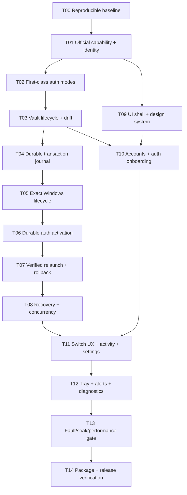

# Codex Account Manager 3.0 — tracer-bullet tickets

Статус: proposed, требуется утверждение владельца
Основание: утверждённая `docs/product-3.0-spec-2026-07-29.md`
Правило исполнения: один ticket — один чистый context; следующий начинается только после проверки предыдущего.

## Dependency order

T00–T08 образуют надёжное ядро. T09–T12 превращают его в законченный продукт. T13–T14 запрещают объявлять 3.0 готовой без измерений и packaged проверки.

## T00 — Reproducible build and protected baseline

**Observable result**

Fresh dependency install, typecheck, lint, unit tests, renderer build и Electron directory package запускаются repository-native командами без interactive build-script approval. Создан baseline report, однозначно отделяющий существующую 2.3.0 от изменений 3.0.

**Touches**

- `package.json`, `pnpm-lock.yaml`, `pnpm-workspace.yaml`;
- при необходимости `.npmrc`, version pin (`packageManager`/tooling config);
- `scripts/` только для deterministic verification;
- `artifacts/3.0/baseline/` и progress file.

**Blocked by**

- ничего.

**Verification**

- clean pnpm store/install in temporary project copy or clean dependency state;
- `pnpm run typecheck`, `lint`, `test:node`, `build:dir`;
- Electron smoke opens packaged directory;
- final diff confirms no unrelated worktree change was overwritten.

**Boundary**

Поведение account switch не меняется.

## T01 — Official Codex capabilities and verified identity slice

**Observable result**

Settings → Diagnostics показывает detected Codex CLI/Desktop version, generated protocol compatibility, supported login methods и verified current identity/workspace. При несовместимой версии пользователь получает bounded actionable error, а не parser failure.

**Touches**

- `src/main/codexRpc.ts`;
- new `src/main/services/codexCapabilityService.ts`;
- `src/shared/codexCapabilities.ts`, IPC schemas/types;
- preload/main IPC registration;
- minimal Diagnostics UI slice;
- unit/integration tests with fake app-server.

**Blocked by**

- T00.

**Verification**

- fake schemas for supported, older and malformed app-server versions;
- actual installed `codex 0.144.0` probe with secrets redacted;
- bounded startup/request timeout and child cleanup tests;
- screenshot Diagnostics at 980 and 1440 widths.

## T02 — First-class authentication modes

**Observable result**

User can create independently typed profiles using ChatGPT browser, device code and API key. Enterprise access token appears only when detected capability supports it. Profile card and validation reflect the real auth mode; API-key profiles no longer show false ChatGPT subscription quotas.

**Touches**

- `src/main/accountManager.ts`, `codexRpc.ts`, `db.ts`;
- auth/account services and validation;
- `src/shared/types.ts`, `authState.ts`, IPC contracts;
- minimal add-account method selector;
- DB migration and tests.

**Blocked by**

- T01.

**Verification**

- browser/device flows via fake app-server and one manual official-flow smoke;
- API key/access-token secrets never appear in argv, logs, DB or renderer DTO;
- duplicate email across workspace IDs remains distinguishable;
- migration of existing ChatGPT profiles to validated/needs-review states.

## T03 — Encrypted profile lifecycle, outgoing backfill and drift

**Observable result**

Inactive profiles have no lingering plaintext `auth.json`; reopening the manager restores them from the encrypted vault. A token rotated by the currently active Codex is backfilled to the correct profile before switch. External login changes surface as `drifted` instead of silently corrupting profile ownership.

**Touches**

- `src/main/security.ts`;
- new/refactored vault/profile-home services;
- `accountManager.ts`, auth validation, DB metadata;
- storage/drift indicators in current account UI;
- vault migration/recovery tests.

**Blocked by**

- T02.

**Verification**

- login → refresh rotation → shutdown → disk scan → restart → identity proof;
- inactive-home plaintext absence test;
- safeStorage unavailable/locked failure is fail-closed;
- external `auth.json` identity mismatch produces drift without overwriting either vault entry;
- no token/JWT strings in logs or SQLite.

## T04 — Durable switch transaction journal

**Observable result**

A dry-run switch creates a visible phase timeline and durable `switch_transactions` record, validates previous/target state and can be cancelled before mutation. Restarting Manager during any pre-write phase reconciles the transaction to `aborted` without changing active auth.

**Touches**

- `src/main/db.ts` migration/repository;
- new `src/main/services/switchTransactionService.ts`;
- shared phase/result DTO and typed errors;
- main/preload IPC and minimal progress UI;
- DB migration/recovery tests.

**Blocked by**

- T03.

**Verification**

- fault injection after each prepare step;
- SQLite constraints permit only one non-terminal transaction;
- repeated reconciliation is idempotent;
- migration/restore test against a realistic copy of 2.3.0 DB;
- transaction rows contain hashes/IDs only, never secret contents.

## T05 — Exact Windows package and process lifecycle

**Observable result**

Diagnostics identifies the exact installed OpenAI package/AppUserModelId, current root and descendants. Switch preparation gracefully closes that exact tree and either reaches `quiesced` or aborts before auth mutation. Coexisting ChatGPT Classic/new Codex produces an explicit choice/error instead of `Select-Object -First 1`.

**Touches**

- split/refactor `src/main/processManager.ts` into package resolver and lifecycle service;
- Windows command runner/PowerShell assets with transaction-unique paths;
- lifecycle settings and Diagnostics UI;
- process-tree fixtures/tests.

**Blocked by**

- T04.

**Verification**

- synthetic root/helper/renderer/app-server trees with PID reuse/start-time mismatch;
- MSIX coexistence fixtures;
- graceful success, timeout, vanished PID and locked-file paths;
- `graceful-only` proves global auth hash unchanged on timeout;
- optional exact-tree fallback kills only recorded descendants and refuses ambiguous/new PIDs.

## T06 — Durable multi-file auth activation

**Observable result**

After confirmed quiesce, a switch can activate a validated target auth bundle and prove stable bytes/identity before launch. Injected write/read-back failure automatically restores the previous bundle; the account is not marked active.

**Touches**

- replace/refactor `src/main/services/switchService.ts`;
- new auth-bundle/durable-file service;
- transaction journal phase integration;
- progress UI details;
- filesystem fault-injection tests.

**Blocked by**

- T05.

**Verification**

- stage/validate/atomic replace/read-back for `auth.json` and conditional compatibility files;
- Windows rename errors 5/32/33 bounded retry only;
- crash/failure at every durable write and directory transition;
- multiple stable checks detect a simulated living process rewriting target auth;
- previous bytes and identity verified after rollback.

## T07 — Exact relaunch, readiness, identity verification and full rollback

**Observable result**

One real button performs the complete 3.0 contract: close → activate → launch the same package → wait for responsive visible window → verify target identity through official app-server → commit active profile. Any launch/identity failure restores and relaunches the previous verified account.

**Touches**

- `accountManager.ts`, lifecycle and transaction services;
- launch/readiness probe;
- typed switch IPC/events;
- progress/success/failure UI;
- fake Desktop/app-server integration harness.

**Blocked by**

- T06.

**Verification**

- happy path asserts `activeAccountId` changes last;
- launch timeout, no visible window, wrong identity/workspace, revoked auth and app-server incompatibility;
- rollback includes previous relaunch/readiness/identity proof;
- no detached runner can report a success outside the transaction;
- first controlled real-machine switch between two test profiles with user login interaction only where required.

## T08 — Startup recovery, cross-process locking and race safety

**Observable result**

Killing Manager at any transaction phase and reopening it deterministically reaches committed previous/target state or an explicit recovery-required screen. Two Manager instances, switch+refresh and switch+reauth cannot overlap or rotate one credential twice.

**Touches**

- transaction recovery coordinator;
- Windows named mutex in main process;
- per-profile async locks/generation IDs;
- startup route/recovery UI;
- recovery/concurrency integration tests.

**Blocked by**

- T07.

**Verification**

- process-kill harness at every phase boundary;
- orphaned unique runner/temp directory reconciliation;
- two-process switch race;
- switch/refresh/re-auth interleavings;
- idempotent recovery rerun and no terminal transaction left active.

## T09 — Modern shell and design system

**Observable result**

The application has a componentized responsive shell with Overview, Accounts, Activity and Settings. It uses the full window productively, preserves labels/focus in collapsed navigation and no longer depends on monolithic `App.tsx`/`styles.css` for every feature.

**Touches**

- split `src/renderer/App.tsx`;
- new `src/renderer/components/ui/`, `layout/`, feature routes;
- design tokens and feature-scoped CSS;
- optimized image assets;
- i18n and visual/accessibility tests.

**Blocked by**

- T01 for real diagnostic state. Can proceed after T01 without waiting for T08.

**Verification**

- visual QA at 980×640, 1180×760, 1440×900, 1920×1080;
- Windows 125/150% scaling smoke;
- keyboard-only navigation, visible focus, accessible names and contrast checks;
- bundle/asset budgets; screenshot comparison approved against the 3.0 direction.

## T10 — Accounts workspace and complete auth onboarding

**Observable result**

Accounts screen offers compact/card density, search, health/auth-mode/workspace/drift states, tags/favorites and unambiguous actions. Add-account flow supports every T02 method with identity preview, duplicate resolution and recovery import.

**Touches**

- `src/renderer/features/accounts/`, `features/auth/`;
- account hooks/state selectors and shared DTOs;
- import/export/reauth main services where required;
- i18n, UI and integration tests.

**Blocked by**

- T03 and T09.

**Verification**

- real/demo datasets for 0, 1, 2, 20 accounts and duplicate emails/workspaces;
- secret fields never persist in renderer/state snapshots;
- interrupted/cancelled login leaves no orphaned profile;
- screenshots/responsive/accessibility for every auth method and error state.

## T11 — Truthful switch UX, Activity and lifecycle Settings

**Observable result**

The user sees previous→target confirmation, live phases with elapsed time, cancel only before write, verified success identity and exact rollback status. Activity lists redacted transactions. Settings exposes graceful-only versus one-time-approved automatic exact-tree fallback, timeouts, storage and recovery state.

**Touches**

- `src/renderer/features/switching/`, `activity/`, `settings/`;
- transaction event query/stream IPC;
- settings service/schema/migration;
- main window behavior and i18n;
- UI/integration tests.

**Blocked by**

- T08 and T10.

**Verification**

- every typed error renders one actionable next step;
- cancel boundary enforced by backend, not only disabled button;
- approval for force fallback is durable, revocable and never implicit;
- Activity/log redaction test;
- visual QA of success, rollback-success and recovery-required flows.

## T12 — Tray, quota alerts and diagnostic bundle

**Observable result**

Tray provides verified active identity, quota summary and quick switch. Threshold alerts fire once per quota window and recommend an eligible spare profile but never auto-switch by default. Redacted diagnostic export previews exactly what will be included.

**Touches**

- main tray/notification services;
- quota scheduling/generation state;
- `features/overview`, Settings and diagnostic export UI;
- redaction contracts/tests.

**Blocked by**

- T11.

**Verification**

- alert cooldown/window reset and superseded refresh tests;
- stale/unknown quota never triggers unsafe recommendation;
- quick switch enters the same T07 transaction, not a shortcut path;
- diagnostic archive contains no tokens, cookies, API keys, raw auth files or personal paths beyond approved redaction level.

## T13 — Fault, soak, accessibility and performance release gate

**Observable result**

Fresh automated evidence demonstrates that 3.0 meets its reliability and speed claims. Failures produce a reproducible report, not manual impressions.

**Touches**

- test harnesses/fixtures only plus bug fixes proven necessary;
- `artifacts/3.0/verification/` reports/screenshots/metrics;
- verification scripts and release checklist.

**Blocked by**

- T12.

**Verification**

- deterministic fault injection at every transaction phase/durable write;
- 1000 synthetic switches;
- process/file-lock/concurrency/sleep-wake/restart/package-coexistence suites;
- 20 real switches between two test profiles when user accounts are available;
- median ≤8 s, p95 ≤20 s excluding Store update, with raw timing evidence;
- axe/keyboard/visual matrix and memory/handle leak check.

## T14 — Packaged Windows 3.0 and independent release verdict

**Observable result**

Versioned 3.0 installer/portable artifact installs, launches, switches, updates according to available signing policy and uninstalls cleanly. An independent `release-verifier` returns ship/no-ship evidence against the approved spec and tickets.

**Touches**

- package metadata/version/release notes;
- electron-builder/update configuration;
- checksum/signing scripts and installer assets;
- README/troubleshooting/release checklist;
- `artifacts/3.0/release/`.

**Blocked by**

- T13.

**Verification**

- clean Windows 11 VM, non-admin user: install → login → switch → close/open → update/manual-update → uninstall;
- Authenticode + RFC 3161 + checksum verification when certificate is available;
- without a certificate, public auto-update remains disabled and artifact is explicitly local/manual;
- main agent reruns decisive gate on the exact packaged commit after independent verifier;
- release notes list known limits: provider revoke, browser account selection and remote connection restart.

## T19 — Interface precision and deterministic Windows packaging

**Observable result**

Dense account actions remain fully contained and readable, long identity and Activity routes never overlap siblings at standard or minimum window sizes, and the normal Windows build path does not depend on a fragile staging-directory rename.

**Touches**

- `src/renderer/v307.css`, Overview and Activity presentation;
- UI regression tests and Electron smoke title/version assertions;
- electron-builder local distribution configuration;
- 3.0.7 release metadata and exact artifact evidence.

**Verification**

- rendered measurements at `1460×900` and `920×620`, including repair/action bounds and zero horizontal overflow;
- long-route and terminal-summary regression tests;
- `pnpm run build` succeeds through the saved configuration;
- exact startup, ASAR parity, fuses, audit and independent local/manual ship verdict.

## T21 — Truthful continuation plan and notification policy

**Observable result**

Overview identifies a next profile only from protected, fresh and known quota state; limit widgets remain readable, and users receive privacy-safe staged in-app/Windows feedback for authorization, restart verification, commit, rollback and threshold alerts.

**Verification**

- unknown/stale/current-error candidates never render a fake numeric reserve;
- notification milestones are deduplicated and do not expose email, tokens or raw provider errors;
- Windows XML is escaped, branded, progress-aware and has a native fallback;
- Chromium geometry passes at `1460×900` and `1080×780`;
- automatic subscription rotation and mid-turn replay are explicitly outside the supported contract.

## Completion rule

Версия называется «готовая 3.0» только после T14. Прохождение source tests без packaged real-machine switch не считается завершением. Любой ticket, обнаруживший нарушение спецификации, исправляет root cause и добавляет regression coverage до перехода дальше.
