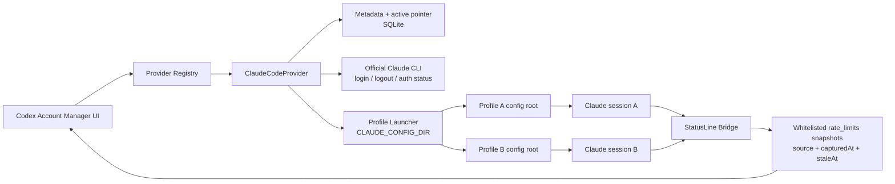

# Claude Code в Codex Account Manager: исследование и готовая архитектура

- Дата исследования: `2026-08-02`
- Часовой пояс: `Europe/Moscow`
- Аудитория: владелец продукта, разработчики main/renderer, release reviewer
- Решение: архитектура для следующего продуктового этапа; продуктовый код в рамках этого исследования не меняется
- Текущий приоритет провайдеров: Codex → Anti-Gravity → Claude Code
- Вердикт: **GO для ограниченного native Windows pilot; NO-GO для копирования OAuth-токенов, приватных usage API и автоматической ротации ради обхода лимитов**

## Краткий ответ

Claude Code можно добавить качественно и без подмены его credential-файлов. Официально поддерживаемая основа уже существует:

1. `CLAUDE_CONFIG_DIR` изолирует настройки, историю, плагины и credentials каждого профиля и прямо документирован как способ запускать несколько аккаунтов параллельно.
2. `claude auth login`, `claude auth logout` и `claude auth status` дают официальный lifecycle авторизации; `auth status` возвращает JSON и машинно-проверяемый exit code.
3. Официальный `statusLine` получает на stdin структурированные `rate_limits.five_hour` и `rate_limits.seven_day` с процентом использования и временем сброса.

Первая версия интеграции должна быть **менеджером изолированных Claude Code-профилей и launcher**, а не «перекладывателем токенов». Она сможет честно показывать официальный session-observed snapshot лимитов managed-сессии. Payload не содержит upstream timestamp, поэтому даже активную карточку нельзя называть гарантированно live, а неактивную — фоново обновляемой. Бесшовно заменить аккаунт внутри уже работающей Claude Code-сессии нельзя: процесс и его история связаны с конфигурационной директорией, с которой он был запущен.

## Границы исследования

### Включено

- официальные способы входа Claude Code;
- безопасное хранение нескольких профилей;
- авторизационный статус и восстановление входа;
- подписочные лимиты Pro/Max и отличие от API spend/rate limits;
- запуск и выбор профиля;
- схема данных, IPC, UI, tray и уведомления;
- миграция текущего двухпровайдерного кода;
- анализ публичного кода конкурентов;
- политика, безопасность, тестирование и поэтапная реализация.

### Исключено

- чтение текущих реальных Claude credentials на компьютере пользователя;
- вход в реальный Claude-аккаунт и расходование его лимитов;
- автоматическая ротация аккаунтов для имитации unlimited usage;
- интеграция Claude Desktop и cloud sessions;
- WSL в первой версии: native Windows и WSL имеют разные home/config/process boundaries;
- реализация продуктового кода до отдельного утверждения.

### Метод

- официальная документация Anthropic проверена на дату исследования;
- архитектура проекта просмотрена по типам, IPC, базе, provider runtime, account manager, renderer и тестам;
- шесть открытых проектов-конкурентов изучены в зафиксированных Git commit;
- факты ниже отделены от инженерных выводов и предложений.

## Доказанные факты

### Авторизация и несколько аккаунтов

**Факт.** [`CLAUDE_CONFIG_DIR`](https://code.claude.com/docs/en/env-vars) переносит весь config root. На Windows и Linux там находятся также credentials; документация прямо называет переменную полезной для нескольких аккаунтов side by side.

**Факт.** [CLI reference](https://code.claude.com/docs/en/cli-usage) предоставляет:

- `claude auth login` с `--email`, `--sso` и `--console`;
- `claude auth logout`;
- `claude auth status`, который возвращает JSON и завершает работу кодом `0` при активном входе или `1` без входа.

**Факт.** [Authentication reference](https://code.claude.com/docs/en/authentication) различает Claude Pro/Max, Team/Enterprise, Console, Bedrock, Google Cloud Agent Platform/Vertex, Microsoft Foundry и self-hosted gateway. На Windows `.credentials.json` наследует ACL пользовательского профиля, а при `CLAUDE_CONFIG_DIR` располагается внутри выбранной конфигурационной директории. Claude Code управляет этим файлом через официальный login/logout flow.

**Факт.** Credentials выбираются по precedence. Cloud provider, `ANTHROPIC_AUTH_TOKEN`, `ANTHROPIC_API_KEY`, `apiKeyHelper` и `CLAUDE_CODE_OAUTH_TOKEN` могут перекрыть обычный subscription OAuth. В частности, незаметно унаследованный `ANTHROPIC_API_KEY` способен перевести сессию на API billing.

**Вывод.** Профиль должен быть отдельным config root, а выбранный аккаунт — environment contract нового процесса. Менеджеру не требуется читать, копировать, шифровать или экспортировать OAuth-token.

### Лимиты и usage

**Факт.** Официальный [`statusLine`](https://code.claude.com/docs/en/statusline) запускает локальную команду, передаёт ей JSON на stdin и не расходует API tokens. В payload доступны:

- `rate_limits.five_hour.used_percentage`;
- `rate_limits.five_hour.resets_at`;
- `rate_limits.seven_day.used_percentage`;
- `rate_limits.seven_day.resets_at`.

`rate_limits` появляется у подписчиков Claude.ai после первого API response; каждое окно может отсутствовать независимо. Значения, следовательно, нельзя подменять нулём или считать доступными до первого ответа.

**Факт.** `refreshInterval` может повторно вызывать status-line команду с минимальным интервалом в одну секунду, однако payload не содержит времени upstream response. Локальный повторный вызов способен снова передать те же session data и не доказывает новую сетевую проверку.

**Факт.** [`/usage`](https://code.claude.com/docs/en/costs) показывает подписчикам plan usage bars, но его подробные local session totals приблизительны и не включают использование на других устройствах. Для API пользователей authoritative billing остаётся в Console.

**Факт.** [API rate limits](https://platform.claude.com/docs/en/api/rate-limits) — другая сущность: они действуют на уровне организации, используют token bucket и непрерывно восстанавливаются; monthly spend limit также не равен Pro/Max subscription capacity.

**Вывод.** Нельзя сводить subscription capacity, API spend, token usage и context window к одному универсальному проценту. Для Pro/Max-сессии официальный status-line payload — лучший supported источник, но его freshness называется `session_observed`, не `live`. Для неактивного профиля честное состояние — «последний известный снимок», а не фальшивый background refresh.

## Модель аккаунтов

| Account kind | Официальный вход | Что хранит Manager | Доступный usage | Первая версия |
| --- | --- | --- | --- | --- |
| Claude Pro / Max | `claude auth login` | ID, label, config path, не-секретный status | 5h/7d из active statusLine | Да |
| Claude Team / Enterprise seat | login/SSO | то же | consumer `rate_limits` официально не подтверждены; org analytics отдельно | Auth/launch да, quota unknown |
| Claude Console / API | `claude auth login --console` или одобренный enterprise flow | metadata и config path | tokens/cost/spend/rate limit как отдельные meters | Auth можно; billing позже |
| Bedrock / Vertex / Foundry | официальный provider environment/SSO | профиль запуска и declarative metadata, без cloud secrets | provider-specific telemetry | Позже |
| Claude apps gateway | corporate SSO | config path + gateway metadata | provider/org-specific | Позже |
| WSL Claude Code | отдельный Linux config root | отдельный environment identity | отдельная telemetry boundary | Отдельная фаза |

## Что показал рынок

Все репозитории исследованы read-only на указанном commit; наличие MIT-файла лицензии не означает, что код следует копировать без отдельного provenance review.

| Проект | Зафиксированный commit | Сильная сторона | Ограничение / решение для нас |
| --- | --- | --- | --- |
| [CC-Switch](https://github.com/farion1231/cc-switch/tree/8383076791f2c0d34f3a249f43f95e8a3906c0a7) | `8383076` | зрелый multi-provider registry, tray, quota sources | большой proxy/API-provider surface; не брать credential takeover как основу consumer OAuth |
| [cc-switch-cli](https://github.com/SaladDay/cc-switch-cli/tree/ce7e9d61baca608a4831c7a59531c830a03dab87) | `ce7e9d6` | provider/config lifecycle, bounded cache и stale-while-revalidate | слишком широкая поверхность; использовать только идеи registry и bounded refresh |
| [Claude-Code-Usage-Monitor](https://github.com/Maciek-roboblog/Claude-Code-Usage-Monitor/tree/c59a83bf943f329f0e61f1a29c760353ee1860a5) | `c59a83b` | provenance-first quota, официальный statusLine, stale TTL, fallback labels | лучший образец truthfulness; взять модель source/confidence/freshness, не код целиком |
| [claudewho](https://github.com/frisble/claudewho/tree/7497574b84cec9d6af8263413bf3f7aeb1d0d0a3) | `7497574` | минимальная изоляция через `CLAUDE_CONFIG_DIR` и launcher aliases | почти нет строгой quota/auth модели |
| [clausona](https://github.com/larcane97/clausona/tree/f9574ee6d897f4503b8ac6fd6d04255598ce7407) | `f9574ee` | wrapper запускает Claude/Codex с выбранным config root | локальные token/cost данные не являются оставшимся subscription limit |
| [ClaudeCodeMultiAccounts](https://github.com/Leuconoe/ClaudeCodeMultiAccounts/tree/634f65b1935598db8792f5f289862a62ea67f3cf) | `634f65b` | демонстрирует потребность в multi-account UX | читает `accessToken`, вызывает приватный `/api/oauth/usage`, обновляет и переписывает credentials; этот подход отвергнут |

### Лучшие решения, которые стоит адаптировать

1. **Изоляция вместо перезаписи.** `claudewho` и `clausona` подтверждают, что profile-per-config-dir прост и устойчив.
2. **Provenance рядом с числом.** Claude-Code-Usage-Monitor различает official, local estimate, stale и unknown; Manager уже имеет похожую основу в `providerAdapter`.
3. **Source-aware last-known state.** Последний корректный снимок остаётся видимым с `observedAt`, `valueChangedAt` и источником, но повторный hook invocation не повышает его до `live`.
4. **Registry вместо разрастания platform branches.** CC-Switch показывает пользу provider descriptors, хотя его общую сложность повторять не нужно.

### Что не следует повторять

- прямое чтение `credentials.claudeAiOauth.accessToken`;
- запрос к недокументированному `https://api.anthropic.com/api/oauth/usage`;
- refresh OAuth token силами стороннего менеджера;
- подмена `.credentials.json` активного профиля;
- парсинг TUI `/usage` или scraping веб-интерфейса;
- автоматическое переключение подписок для обхода Technical Limitations.

## Текущее состояние Codex Account Manager

### Что уже подходит

- DPAPI vault, SQLite migrations и audit trail;
- provider capability/confidence/source/reason в `src/shared/providerAdapter.ts`;
- per-provider lock, switch transaction и rollback;
- quota history, freshness и tray rendering;
- typed IPC и renderer state management.

### Технический долг, который надо закрыть до Claude

`AccountPlatform` сейчас закрыт значениями `"codex" | "antigravity"`. Provider union, IPC schemas и runtime registry также захардкожены. Свежий статический поиск нашёл около 170 provider/platform references в `accountManager.ts`, а provider-aware логика затрагивает 36 TypeScript/TSX source-файлов. Это не 170 независимых ветвей, но достоверный индикатор широкого blast radius.

Критический дефект миграционной готовности находится в `db.ts`: неизвестное значение platform в нескольких mapper-path превращается в `codex`. После добавления третьего провайдера это могло бы молча интерпретировать Claude-row как Codex-row. Перед расширением требуется строгая валидация ID и quarantine неизвестных записей.

Ещё два опасных two-provider assumption подтверждены source-кодом:

- `smartSelection.ts` исключает только `antigravity`, поэтому новый `claude_code` без capability gate попадёт в Codex recommendation/auto-switch path;
- tray handlers в `main.ts` вызывают generic `switchAccount`, а Claude v1 должен поддерживать только `activate for next launch` и `launch`;
- текущий `deleteAccount` рекурсивно удаляет manager-owned `profileDir`. Для Claude внутри него находится `.credentials.json`, поэтому общий delete path недопустим.

| Corridor | Требуемое изменение |
| --- | --- |
| Shared types | extensible `ProviderId`; discriminated account/auth/meter types |
| IPC schemas | provider descriptor schema вместо exact two-value union |
| DB | schema migration; strict provider decode; unknown-row quarantine; provider metadata |
| Provider runtime | registry/descriptor с capabilities, auth, collectors, launcher semantics |
| Account manager | убрать platform switch fan-out; orchestration через adapter contracts |
| Auth | официальные CLI commands под per-profile env; без credential payload |
| Quota | statusLine bridge + typed meters + observed/change/reset freshness |
| Switch/launch | active pointer для next launch; session binding и process tracking |
| Scheduler | active-session signals отдельно от background freshness |
| Tray/notifications | provider-aware icon, source, freshness и reset label |
| Renderer | provider tabs/cards, account kind и truthful empty/stale states |
| Export/import | metadata-only для Claude; credentials всегда исключены |
| Tests | fake CLI, fixtures, migration, env precedence, concurrency, secret scan |

Текущие account columns `email`, `plan_type`, `profile_dir` и `encrypted_auth_json` нельзя механически переиспользовать как Claude truth. Phase 0 должна либо сделать provider-neutral metadata nullable/discriminated, либо вынести Claude-specific profile metadata в отдельную таблицу; пустая строка не считается значением. Generic `Open profile folder` также capability-gated: по умолчанию нельзя открывать каталог, содержащий `.credentials.json`, без предупреждения о чувствительных данных.

## Рекомендуемая архитектура



### 1. Provider descriptor

Новый provider должен регистрироваться декларативно:

```ts
type ProviderDescriptor = {
  id: ProviderId;
  displayName: string;
  accountKinds: readonly AccountKind[];
  capabilities: {
    officialInteractiveLogin: boolean;
    isolatedProfiles: boolean;
    sessionSubscriptionSnapshots: boolean;
    backgroundQuotaRefresh: boolean;
    encryptedCredentialExport: boolean;
    switchExistingSession: boolean;
  };
  authAdapter: AuthAdapter;
  meterCollectors: readonly MeterCollector[];
  launchAdapter: LaunchAdapter;
};
```

Claude v1 capabilities должны быть:

- `officialInteractiveLogin=true`;
- `isolatedProfiles=true`;
- `sessionSubscriptionSnapshots=true` только для official statusLine collector и с freshness `session_observed`;
- `backgroundQuotaRefresh=false` для consumer subscription;
- `encryptedCredentialExport=false`;
- `switchExistingSession=false`.

### 2. Profile storage

Предлагаемый root:

```text
%APPDATA%/Codex Account Manager/providers/claude-code/profiles/<profile-id>/config/
```

В SQLite хранить только:

- internal profile ID;
- user label; email сохраняется только если конкретная закреплённая CLI schema отдельно проверена и поле разрешено контрактом;
- account kind (`subscription`, `team`, `enterprise`, `console`, `cloud`, `gateway`, `unknown`) с provenance `user_declared` или `verified_cli`; по недокументированным JSON keys его угадывать нельзя;
- canonical config path;
- auth state, CLI version и safe identity fingerprint;
- active/default pointer;
- timestamps и health state;
- meter snapshots без transcript/cwd/prompt/session content.

`.credentials.json` остаётся внутри config root и принадлежит Claude Code. Manager не включает его в vault, backup, export, diagnostics или logs.

### 3. Добавление аккаунта

1. Проверить наличие `claude` и поддерживаемую минимальную версию.
2. Создать manager-owned config root с безопасным ACL и проверкой reparse points.
3. Запустить `claude auth login` с `CLAUDE_CONFIG_DIR=<profile-root>`.
4. После завершения вызвать `claude auth status` в том же environment.
5. В v1 сохранить только документированный результат logged-in/not-logged-in из exit code, CLI version и user label. JSON schema pin и allowlist отдельных identity fields — самостоятельный gate, потому что официальная страница обещает JSON, но не фиксирует список ключей.
6. Показать account kind, auth source и предупреждение о переменных, перекрывающих subscription login.

Для SSO и Console UI передаёт официальные флаги, но не реализует собственный OAuth callback.

### 4. Запуск и переключение

Кнопка должна называться **«Активировать для следующего запуска»**, а не обещать мгновенную смену аккаунта внутри существующей сессии.

- active pointer выбирает environment будущих launcher-команд;
- `Launch Claude Code` стартует новый terminal/process с выбранным `CLAUDE_CONFIG_DIR`;
- одновременно могут работать разные профили в разных процессах;
- процесс, уже запущенный с Profile A, остаётся Profile A;
- переключение active pointer не закрывает и не перепривязывает существующую сессию;
- resume command разрешён только внутри того же profile root.

Это предохраняет историю сессий и исключает mid-turn identity change.

### 5. StatusLine Bridge

Bridge — локальная короткоживущая команда внутри managed profile settings:

1. читает один JSON document со stdin;
2. валидирует schema и Claude Code version;
3. выбирает только `rate_limits.*.used_percentage`, `resets_at`, `version` и capture time;
4. нормализует percentage в диапазон `0..100` без выдумывания отсутствующих полей;
5. атомарно пишет snapshot во временный файл и выполняет replace;
6. не сохраняет `cwd`, transcript path, session ID, prompt ID, repository или cost;
7. если у пользователя уже есть statusLine, безопасно вызывает исходную команду и возвращает её stdout без изменений.

Manager не должен молча перезаписывать существующий `statusLine`. Установка bridge требует явного согласия и сохраняет обратимый backup только настройки, но не credentials. При невозможности корректно составить цепочку UI оставляет ручную инструкцию.

`refreshInterval` по умолчанию не устанавливается: event-driven hook снижает число ложных «обновлений». Если пользователь включает interval для собственной statusLine, bridge хранит отдельные поля:

- `observedAt` — когда Manager локально увидел payload;
- `valueChangedAt` — когда изменился процент или reset epoch;
- `responseFreshness="unknown"` — upstream timestamp отсутствует;
- `validUntil` — не позже соответствующего `resets_at`.

Повторный одинаковый payload меняет только `observedAt` и никогда не делает snapshot `live`. После `resets_at` старое окно становится `expired/unknown`, пока Claude Code не отдаст новое значение. Alert разрешён только при доказанном изменении значения/reset epoch, а не от повторного hook invocation.

### 6. Новая meter model

```ts
type ProviderMeter =
  | SubscriptionCapacityMeter
  | ApiSpendMeter
  | TokenUsageMeter
  | ContextWindowMeter;

type MeterEvidence = {
  source: "official_statusline" | "official_admin_api" | "local_estimate" | "manual";
  confidence: "verified" | "derived" | "unknown";
  scope: "account" | "organization" | "workspace" | "session";
  observedAt: string;
  valueChangedAt: string | null;
  responseFreshness: "unknown" | "source_timestamped";
  validUntil: string | null;
  error: MeterError | null;
};
```

`SubscriptionCapacityMeter` содержит независимый список окон, а UI выбирает фактически ограничивающее окно по минимальному remaining percent с валидным reset. `ContextWindowMeter` никогда не участвует в выборе аккаунта: это состояние разговора, не подписки.

### 7. Environment hygiene

Перед запуском Manager строит effective auth report:

- cloud provider flags;
- `ANTHROPIC_AUTH_TOKEN`;
- `ANTHROPIC_API_KEY`;
- configured `apiKeyHelper`;
- `CLAUDE_CODE_OAUTH_TOKEN`;
- subscription login.

Секретные значения не читаются и не логируются — проверяется только присутствие/источник. Если выбран subscription profile, но более приоритетная переменная активна, запуск блокируется понятным предупреждением или выполняется только после явного решения пользователя. Автоматически удалять переменные из системного environment нельзя; можно сформировать чистый child-process env.

## UX первой версии

### Account card

- Claude Code logo + provider label;
- user label; email — только из schema-pinned allowlisted identity field;
- badge `Pro`, `Max 5×`, `Max 20×`, `Team`, `Enterprise`, `Console` показывается вместе с provenance; иначе `Не определено`;
- auth badge: `Вход подтверждён`, `Требуется вход`, `Перекрыт API key`, `CLI недоступен`;
- quota source: `Официальный снимок из сессии`, `Последний снимок`, `Истёк`, `Нет данных`; label `Live` запрещён без source timestamp;
- одно ограничивающее окно крупно, остальные — в деталях;
- actions: `Запустить`, `Активировать`, `Проверить вход`, `Войти снова`, `Открыть /usage`, `Удалить профиль`.

### Tray

Tray показывает активный provider и только подтверждённый limiting meter. Для Claude:

- session-observed snapshot — процент и reset с честным source label;
- stale — приглушённый процент + age;
- неизвестно — `—`, без искусственного `0%`;
- tooltip явно говорит `Claude Code · активен для следующего запуска` или `Claude Code · 2 процесса`.

### Уведомления

Только in-app:

- профиль добавлен и официальный вход подтверждён;
- profile active pointer изменён;
- Claude запущен с выбранным профилем;
- statusLine начал отдавать official session snapshots;
- осталось 10%/3% в limiting window;
- вход истёк или перекрыт environment credential;
- окно snapshot истекло по `resets_at` или сессия остановилась.

Звук — только для error/critical threshold, с debounce и cooldown на профиль+окно+reset epoch.

## Security и policy boundary

### GO

- официальный `CLAUDE_CONFIG_DIR`;
- официальный login/logout/status CLI;
- официальный statusLine JSON;
- локальное хранение whitelisted quota fields;
- launcher новых процессов;
- metadata-only export;
- ручное переключение активного профиля для следующего запуска.

### NO-GO

- token extraction/copy/refresh;
- private OAuth usage endpoint;
- TUI/web scraping;
- credential sharing/export;
- смена identity в уже выполняющемся turn;
- автоматическая ротация для обхода capacity limits;
- маркетинг, создающий впечатление официального продукта Anthropic.

[Consumer Terms](https://www.anthropic.com/legal/consumer-terms) запрещают передачу credentials, неразрешённый scraping, неразрешённый automated access и обход защитных механизмов. Официально документированные CLI/environment/statusLine surfaces существенно безопаснее, но перед публичным релизом всё равно нужен policy review актуальной редакции Terms. Название и UI должны говорить «совместимо с Claude Code», не заявляя affiliation или endorsement.

Исследованная редакция Consumer Terms относится к потребителям EEA/Switzerland и не является универсальным заключением для Team/Enterprise, Console/API или других юрисдикций. Для коммерческих/API сценариев действуют отдельные Commercial Terms и договор организации. Поэтому `NO-GO` выше — безопасная продуктовая граница, а не заявление, что один consumer-документ исчерпывает все правовые режимы.

## План реализации

### Phase 0 — provider contract hardening

- заменить closed platform union на validated provider ID/descriptor;
- исправить silent DB fallback unknown → Codex;
- добавить quarantine и migration fixtures;
- разделить account metadata, auth material и provider meters;
- ввести capability gates `recommend`, `switchExistingSession`, `activateForNextLaunch`, `launch`, `deleteManagedCredentials`;
- сделать `switchAccount` optional provider operation, а не обязательным generic adapter method;
- исключить Claude из Codex `smartSelection`, workspace binding, refresh-all, switch transactions, tray `switchAccount` и auto-switch до явного adapter support;
- capability-gate `openProfileFolder`; для Claude v1 действие скрыто или открывается только после предупреждения;
- сохранить поведение Codex/Anti-Gravity без изменений.

**Gate:** старые базы мигрируют детерминированно; неизвестный provider никогда не становится Codex; Claude не проходит ни через один Codex switch/recommend/workspace/refresh/tray path; nullable/discriminated metadata не подменяется пустыми строками; все существующие tests зелёные.

### Phase 1 — Claude CLI discovery и auth fixtures

- version discovery и minimum supported version;
- fake `claude` executable для CI;
- adapters для login/logout/status;
- strict JSON subset parser;
- environment-precedence detector;
- account kind mapper.

**Gate:** ни один тест не использует реальные credentials или сеть; secrets отсутствуют в snapshot/log/export.

### Phase 2 — managed profiles и launcher

- secure config roots;
- create/login/re-login/detach profile;
- active pointer;
- launch native Windows Terminal/PowerShell с чистым child env;
- process registry и session/profile binding.

Удаление по умолчанию означает **detach metadata**, сохраняя config root и официальный вход. Необратимое `Erase Claude profile and sign-in` — отдельное действие с повторным вводом label, проверкой отсутствия running sessions, canonical path/reparse-point validation, показом точного target и вызовом официального logout до удаления manager-owned root. Общий `deleteAccount` не используется.

**Gate:** два fake profiles работают параллельно, смена default не затрагивает уже запущенный процесс, restart/reboot сохраняет metadata; detach не удаляет `.credentials.json`; destructive erase закрыт отдельными path/process/reparse tests.

### Phase 3 — official quota bridge

- reversible statusLine composition;
- whitelist parser и atomic snapshots;
- independent 5h/7d windows;
- observed/value-changed/source freshness, reset expiry и errors без искусственного TTL-live;
- limiting-window selection.

**Gate:** fixtures покрывают absent/null/malformed/out-of-range/repeated-identical/reset-expired, concurrent sessions и out-of-order atomic writes; более старый observation не перезаписывает новый, repeated hook не повышает freshness; исходная statusLine сохраняет stdout; transcript/path/session fields никогда не сохраняются.

### Phase 4 — UI, tray и notifications

- provider navigation;
- cards/details/empty/stale states;
- Claude tray state;
- deduplicated in-app alerts;
- accessibility, scaling и keyboard flows.

**Gate:** визуальные fixtures на 100/125/150/200% DPI, 9-account viewport, no-overlap, screen reader labels, manual native terminal launch.

### Phase 5 — organization/API telemetry

- Team/Enterprise Claude Code analytics и Admin Usage API только после отдельной спецификации;
- API tokens/cost/spend отображаются отдельными meters;
- provider/cloud billing source всегда указан.

**Gate:** API spend никогда не маскируется под Pro/Max remaining percent.

### Phase 6 — WSL и IDE

- отдельный discovery/launch/ACL/process spec;
- WSL distribution и Linux config roots;
- VS Code integration без credential copying.

**Gate:** native Windows и WSL profiles невозможно перепутать или перезаписать.

## Acceptance matrix

| Риск | Проверка | Ожидаемый результат |
| --- | --- | --- |
| Credential leak | scan DB, logs, report, export, crash artifacts | нет token/key/credential JSON |
| Env override | все precedence combinations | источник входа показан правдиво; неоднозначный запуск блокируется |
| Profile isolation | два одновременных fake CLI | разные config roots, нет cross-write |
| Existing session | сменить active pointer при работающем процессе | процесс сохраняет исходный profile binding |
| Smart selection | добавить Claude рядом с Codex | Claude не участвует в recommend/auto-switch и tray switch; доступен activate/launch |
| StatusLine compatibility | existing command + bridge | пользовательский output не меняется |
| Repeated statusLine | повторить одинаковый payload по interval | меняется только `observedAt`; snapshot не становится live |
| Out-of-order statusLine | две concurrent sessions пишут снимки в обратном порядке | sequence/observation guard сохраняет более новый accepted snapshot |
| Missing rate_limits | payload до первого API response | `Нет данных`, не `0%` |
| Reset expiry | перевести часы за `resets_at` без нового payload | окно `expired/unknown`, не live и не 0% |
| DB forward compatibility | unknown provider row | quarantine/error, не Codex |
| Restart/reboot | повторный запуск Manager | metadata и active pointer сохранены; login принадлежит Claude config root |
| Detach | удалить Claude card | metadata удалены, config root/credentials сохранены |
| Destructive erase | удалить profile root | отдельное подтверждение, no-running-session и canonical/reparse checks |
| Open profile folder | вызвать generic action на Claude | действие скрыто либо предупреждает о `.credentials.json`; secret не preview/log |
| Uninstall | удалить Manager с сохранением/удалением data | явный выбор; credentials не экспортируются скрыто |

## Нерешённые вопросы

1. Минимальную поддерживаемую Claude Code version надо зафиксировать после runtime fixture matrix; `rate_limits` требует актуального клиента и официально описан для Claude.ai Pro/Max после первого response.
2. Нужен безопасный формат композиции существующего Windows PowerShell/Git Bash statusLine; если исходная команда сложная, лучше предложить ручное подключение.
3. Официальный background endpoint для consumer quota не обнаружен. До появления документированного API inactive-profile live polling остаётся `DEFER`.
4. Официальная CLI-страница не закрепляет keys JSON от `auth status`; email/account kind/plan требуют schema pin и fixture evidence. UI должен допускать `Не определено`, а не угадывать Max tier по quota.
5. Team/Enterprise statusLine capacity не подтверждена официальной схемой для Pro/Max; analytics обновляется не как consumer capacity и требует организационных прав. Это отдельный capability.
6. Политика Anthropic и CLI schema могут меняться; перед каждым релизом интеграции нужен contract monitor.

## Решение для следующего шага

Рекомендован отдельный implementation milestone **Claude Code Provider Pilot** с Phase 0–3. Он даст:

- несколько официально авторизованных изолированных профилей;
- стабильный вход, переживающий restart Manager/Windows в пределах lifecycle Claude Code;
- запуск Claude Code под выбранным профилем без credential swapping;
- официальные session-observed Pro/Max snapshots и честный last-known/expired state без ложного live;
- безопасную основу для UI/tray без притворного unlimited usage.

Начинать UI до Phase 0 нельзя: текущий silent provider fallback создаёт риск повреждения данных. Начинать с OAuth copying нельзя: официальный profile-isolation путь уже лучше и безопаснее.

## Source manifest

### Официальные первичные источники

- [Claude Code: Environment variables](https://code.claude.com/docs/en/env-vars) — `CLAUDE_CONFIG_DIR`, multi-account isolation; проверено `2026-08-02`.
- [Claude Code: CLI reference](https://code.claude.com/docs/en/cli-usage) — login/logout/auth status JSON; проверено `2026-08-02`.
- [Claude Code: Authentication](https://code.claude.com/docs/en/authentication) — account kinds, storage, precedence, expiry; проверено `2026-08-02`.
- [Claude Code: Status line](https://code.claude.com/docs/en/statusline) — official rate-limit schema, refresh behavior, local execution; проверено `2026-08-02`.
- [Claude Code: Manage costs](https://code.claude.com/docs/en/costs) — `/usage`, local estimates, subscriber/API semantics; проверено `2026-08-02`.
- [Claude Platform: Rate limits](https://platform.claude.com/docs/en/api/rate-limits) — API organization limits and token bucket; проверено `2026-08-02`.
- [Claude Code Usage Report API](https://platform.claude.com/docs/en/api/admin/usage_report/retrieve_claude_code) — organization analytics surface; проверено `2026-08-02`.
- [Anthropic Consumer Terms](https://www.anthropic.com/legal/consumer-terms) — credential, automation, scraping, bypass и brand boundary; редакция effective `2025-10-08`, проверено `2026-08-02`.

### Публичный код конкурентов

- [farion1231/cc-switch @ 8383076](https://github.com/farion1231/cc-switch/tree/8383076791f2c0d34f3a249f43f95e8a3906c0a7), MIT file observed.
- [SaladDay/cc-switch-cli @ ce7e9d6](https://github.com/SaladDay/cc-switch-cli/tree/ce7e9d61baca608a4831c7a59531c830a03dab87), MIT file observed.
- [Maciek-roboblog/Claude-Code-Usage-Monitor @ c59a83b](https://github.com/Maciek-roboblog/Claude-Code-Usage-Monitor/tree/c59a83bf943f329f0e61f1a29c760353ee1860a5), MIT file observed.
- [frisble/claudewho @ 7497574](https://github.com/frisble/claudewho/tree/7497574b84cec9d6af8263413bf3f7aeb1d0d0a3), MIT file observed.
- [larcane97/clausona @ f9574ee](https://github.com/larcane97/clausona/tree/f9574ee6d897f4503b8ac6fd6d04255598ce7407), MIT file observed.
- [Leuconoe/ClaudeCodeMultiAccounts @ 634f65b](https://github.com/Leuconoe/ClaudeCodeMultiAccounts/tree/634f65b1935598db8792f5f289862a62ea67f3cf), MIT file observed; credential/private-endpoint approach rejected.

### Локальные owner sources

- `src/shared/types.ts`
- `src/shared/ipcSchemas.ts`
- `src/shared/providerAdapter.ts`
- `src/main/services/providerRuntimeAdapter.ts`
- `src/main/accountManager.ts`
- `src/main/db.ts`
- `src/main/preload.ts`
- `src/renderer/App.tsx`
